## CG HW1 Report

- **Key Function 'W'**: Toggle between solid and wireframe modes using `glPolygonMode`. \
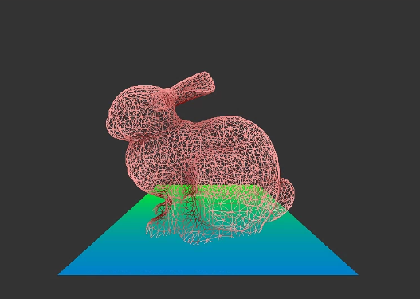 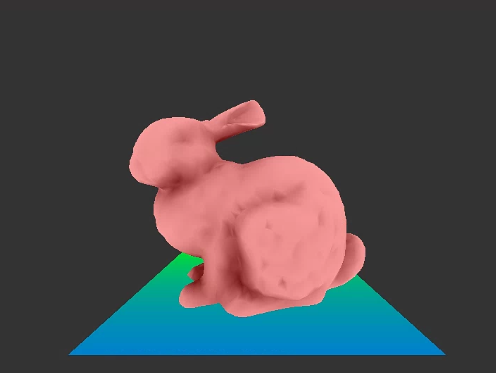

- **Key Function 'Z/X'**: Switch between models, storing and altering model information without affecting other models. \
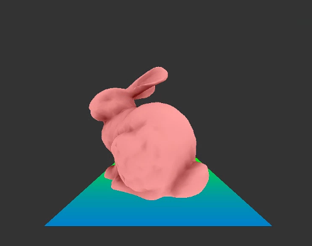 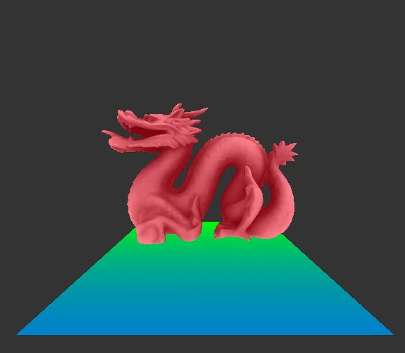

- **Key Function 'O'**: Change to Orthogonal projection using the `setOrthogonal` function.
- **Key Function 'P'**: Switch to NDC Perspective projection with the `setPerspective` function. \
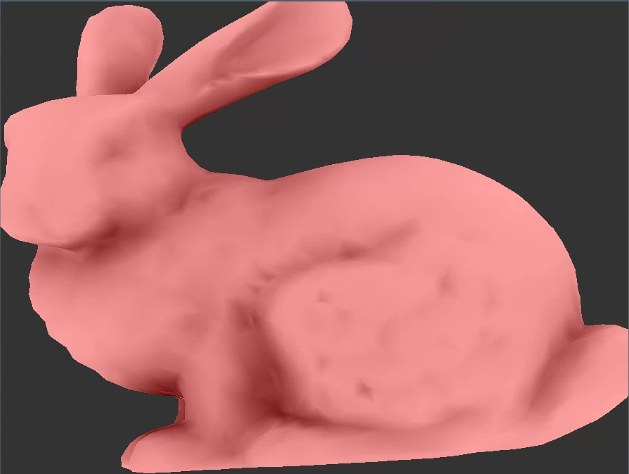 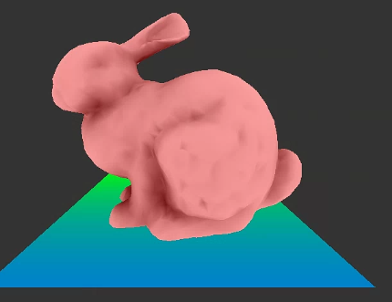

- **Key Function 'T'**: Translate model based on mouse input. 
    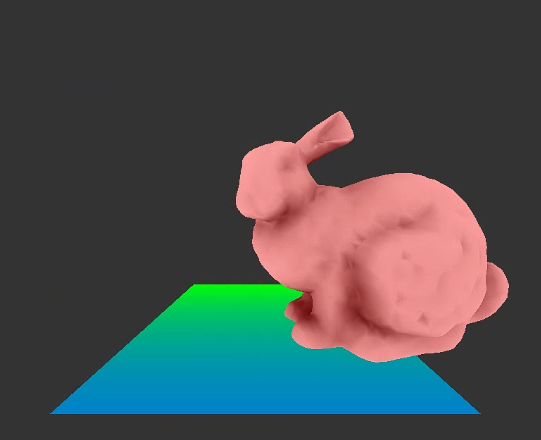

- **Key Function 'S'**: Scale model using mouse input.
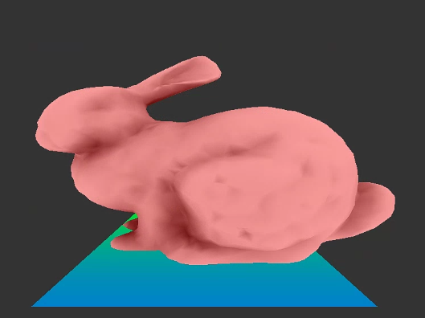

- **Key Function 'R'**: Rotate model based on mouse movement. 
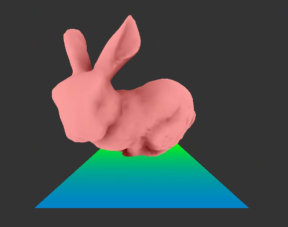

- **Key Function 'E'**: Translate eye position, altering the model's view as if from the human eye.
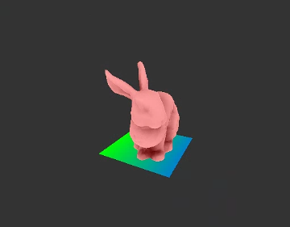

- **Key Function 'C'**: Change the viewing center position.
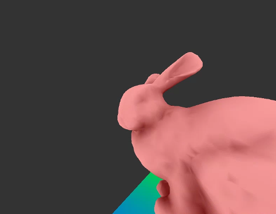

- **Key Function 'U'**: Alter the camera's up vector position. 
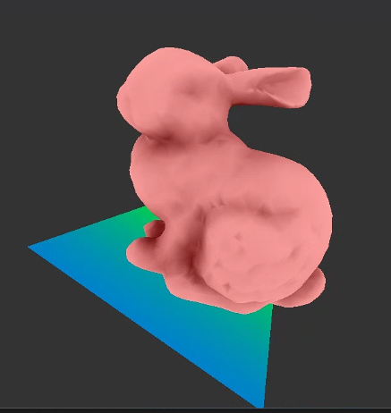

- **Key Function 'I'**: Print out information such as Translation Matrix, Rotation Matrix, Scaling Matrix, Viewing Matrix, Projection Matrix.
