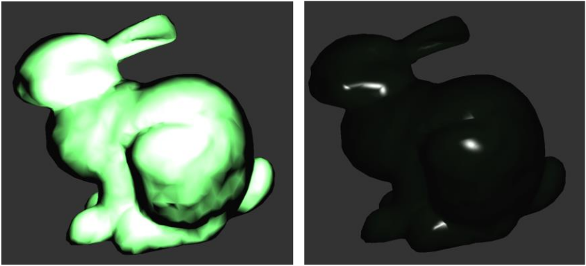

## CG HW2 Report

- **Light Editing Mode**: Activate with 'K'. Control light source position with cursor movements. \
 
 

- **Shininess Editing Mode**: Activate with 'J'. Adjust brightness using the mouse scroll wheel. \
 

- **Light Mode Switching**: Press 'L' to switch between directional, point, and spot lights. \
directional light: \
 \
point light: \
  \
spot light: \
  \

- **Lighting Models**: Window displays two models - one with vertex lighting, the other with pixel lighting. \
 

- **Technical Challenges**: \
Focused on data transmission to vertex and fragment shaders, handling of split-screen views for different lighting models, and managing aspect ratios for proper model rendering.