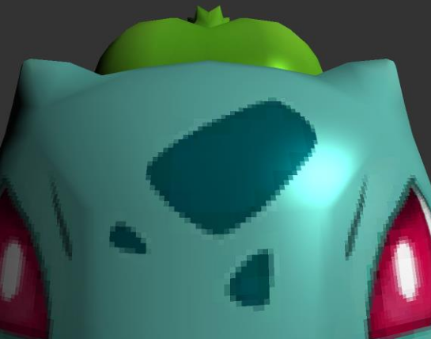
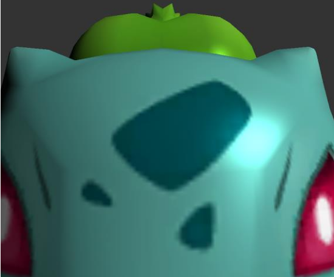
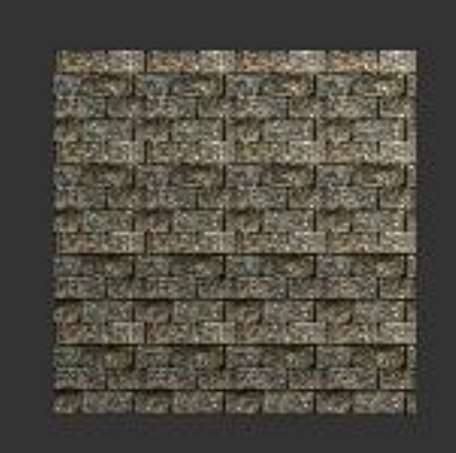
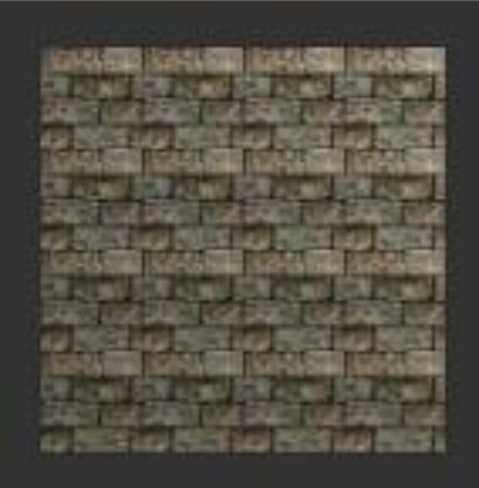
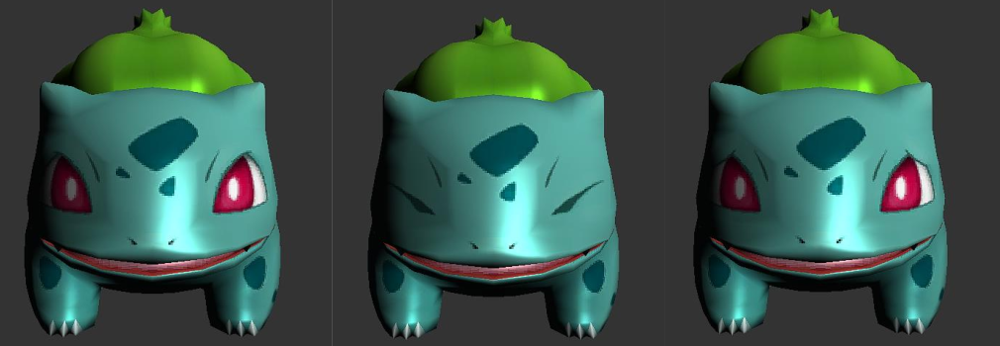

## CG HW3 Report

- **Magnification Texture Filtering Mode (Key 'G')**: Toggle between nearest and linear sampling. \
    Nearest sampling: \
     \
    Linear sampling: \
     
- **Minification Texture Filtering Mode (Key 'B')**: Switch between nearest and linear_mipmap_linear sampling. \
    Nearest sampling: \
     \
    linear_mipmap_linear sampling: \
     

- **Expression Changes**: Use directional keys for altering facial expressions. \
     

- **Technical Aspects**: Challenges included texture coordinate transmission and determining when to draw eyes, involving offset transmission to the shader.